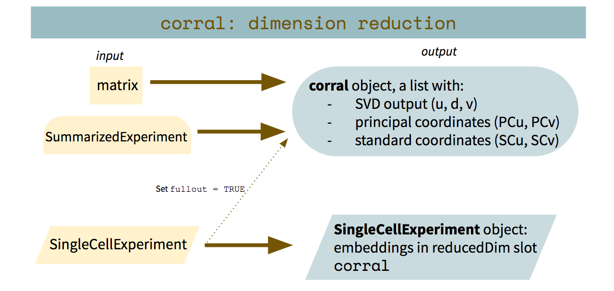

```{r setup, include=FALSE}
knitr::opts_chunk$set(echo = TRUE)
library(gridExtra)
```

# Introduction

Single-cell 'omics analysis enables high-resolution characterization of heterogeneous 
populations of cells by quantifying measurements in individual cells and thus 
provides a fuller, more nuanced picture into the complexity and heterogeneity between 
cells. However, the data also present new and significant challenges as compared to 
previous approaches, especially as single-cell data are much larger and sparser than 
data generated from bulk sequencing methods. Dimension reduction is a key step 
in the single-cell analysis to address the high dimension and sparsity of these 
data, and to enable the application of more complex, computationally expensive downstream pipelines.

Correspondence analysis (CA) is a matrix factorization method, and is similar to 
principal components analysis (PCA). Whereas PCA is designed for application to 
continuous, approximately normally distributed data, CA is appropriate for 
non-negative, count-based data that are in the same additive scale. `corral` 
implements CA for dimensionality reduction of a single matrix of single-cell data. 

See the vignette for `corralm` for the multi-table adaptation of CA for single-cell batch alignment/integration.

corral can be used with various types of input. When called on a matrix (or other matrix-like object), it returns a list with the SVD output, principal coordinates, and standard coordinates. When called on a `r Biocpkg('SingleCellExperiment')`, it returns the `r Biocpkg('SingleCellExperiment')` with the corral embeddings in the `reducedDim` slot named `corral`. To retrieve the full list output from a `SingleCellExperiment` input, the `fullout` argument can be set to `TRUE`.


# Loading packages and data

We will use the `Zhengmix4eq` dataset from the `r Biocpkg('DuoClustering2018')` package.

```{r, message = FALSE}
library(corral)
library(SingleCellExperiment)
library(ggplot2)
library(DuoClustering2018)
zm4eq.sce <- sce_full_Zhengmix4eq()
zm8eq <- sce_full_Zhengmix8eq()
```

This dataset includes approximately 4,000 pre-sorted and annotated cells of 
4 types mixed by Duo et al. in approximately equal proportions [@zmdata]. 
The cells were sampled from a "Massively parallel digital transcriptional 
profiling of single cells" [@zheng].

```{r}
zm4eq.sce
table(colData(zm4eq.sce)$phenoid)
```


# `corral` on `r Biocpkg('SingleCellExperiment')`

We will run `corral` directly on the raw count data:

```{r}
zm4eq.sce <- corral(inp = zm4eq.sce, 
                    whichmat = 'counts')

zm4eq.sce
```

We can use `plot_embedding` to visualize the output:

```{r}
plot_embedding_sce(sce = zm4eq.sce,
                   which_embedding = 'corral',
                   plot_title = 'corral on Zhengmix4eq',
                   color_attr = 'phenoid',
                   color_title = 'cell type',
                   saveplot = FALSE)
```

Using the `scater` package, we can also add and visualize `umap` and `tsne` embeddings based on the `corral` output:

```{r}
library(scater)
library(gridExtra) # so we can arrange the plots side by side

zm4eq.sce <- runUMAP(zm4eq.sce,
                     dimred = 'corral',
                     name = 'corral_UMAP')
zm4eq.sce <- runTSNE(zm4eq.sce,
                     dimred = 'corral',
                     name = 'corral_TSNE')

ggplot_umap <- plot_embedding_sce(sce = zm4eq.sce,
                                  which_embedding = 'corral_UMAP',
                                  plot_title = 'Zhengmix4eq corral with UMAP',
                                  color_attr = 'phenoid',
                                  color_title = 'cell type',
                                  returngg = TRUE,
                                  showplot = FALSE,
                                  saveplot = FALSE)

ggplot_tsne <- plot_embedding_sce(sce = zm4eq.sce,
                                  which_embedding = 'corral_TSNE',
                                  plot_title = 'Zhengmix4eq corral with tSNE',
                                  color_attr = 'phenoid',
                                  color_title = 'cell type',
                                  returngg = TRUE,
                                  showplot = FALSE,
                                  saveplot = FALSE)

multiplot(ggplot_umap, ggplot_tsne, cols = 2)

```

The `corral` embeddings stored in the `reducedDim` slot can be used in 
downstream analysis, such as for clustering or trajectory analysis.

`corral` can also be run on a `SummarizedExperiment` object.

# `corral` on matrix

`corral` can also be performed on a matrix (or matrix-like) input.

```{r}
zm4eq.countmat <- assay(zm4eq.sce,'counts')
zm4eq.countcorral <- corral(zm4eq.countmat)
```

The output is in a `list` format, including the SVD output (`u`,`d`,`v`), 
the standard coordinates (`SCu`,`SCv`), and the principal coordinates (`PCu`,`PCv`).

```{r}
zm4eq.countcorral
```

We can use `plot_embedding` to visualize the output:
(the embeddings are in the `v` matrix because these data are by genes in the 
rows and have cells in the columns; if this were reversed, with cells in the 
rows and genes/features in the column, then the cell embeddings would instead 
be in the `u` matrix.)
```{r}
celltype_vec <- zm4eq.sce$phenoid
plot_embedding(embedding = zm4eq.countcorral$v,
               plot_title = 'corral on Zhengmix4eq',
               color_vec = celltype_vec,
               color_title = 'cell type',
               saveplot = FALSE)
```

The output is the same as above with the `SingleCellExperiment`, and can be 
passed as the low-dimension embedding for downstream analysis. Similarly, 
UMAP and tSNE can be computed for visualization. (Note that in performing SVD, 
the direction of the axes doesn't matter so they may be flipped between runs, 
as `corral` and `corralm` use `irlba` to perform fast approximation.)

# Updates to CA to address overdispersion

Correspondence analysis is known to be sensitive to "rare objects" (Greenacre, 2013). Sometimes this can be beneficial because the method can detect small perturbations of rare populations. However, in other cases, a couple outlier cells can be allowed to exert undue influence on a particular dimension.

In the `corral` manuscript, we describe three general approaches, included below; see our manuscript for more details and results. In this vignette we also present a fourth approach (Trimming extreme values with `smooth` mode)

## Changing the residual type (`rtype`)

Standard correspondence analysis decomposes Pearson $\chi^2$ residuals, computed with the formula:
$$r_{p; ij} = \frac{\mathrm{observed} - \mathrm{expected}}{\sqrt{\mathrm{expected}}} = \frac{p_{ij} - p_{i.} \ p_{.j}}{\sqrt{p_{i.} \ p_{.j}}}$$

where $p_{ij} = \frac{x_{ij}}{N}$, $N = \sum_{i=1}^m \sum_{j=1}^n x_{ij}$, $p_{i.} = \mathrm{row \ weights} = \sum_{i=1}^m p_{ij}$, and $p_{.j} = \mathrm{col \ weights} = \sum_{j=1}^n p_{ij}$.

In `corral`, this is the default setting. It can also be explicitly selected by setting `rtype = 'standardized'` or `rtype = 'pearson'`.

Another $\chi^2$ residual is the Freeman-Tukey:
$$r_{f; ij} = \sqrt{p_{ij}} + \sqrt{p_{ij} + \frac{1}{N}} - \sqrt{4 p_{i.} \ p_{.j} + \frac{1}{N}}$$

It is more robust to overdispersion than the Pearson residuals, and therefore outperforms standard CA in many scRNAseq datasets.

In `corral`, this option can be selected by setting `rtype = 'freemantukey'`.

## Variance stabilization before CA (`vst_mth`)

Another approach for addressing overdispersed counts is to apply a variance stabilizing transformation. The options included in the package:

- Square root transform ($\sqrt{x}$): `vst_mth = 'sqrt'`
- Anscombe transform ($2 \sqrt{x + \frac{3}{8}}$): `vst_mth = 'anscombe'`
- Freeman-Tukey transform ($\sqrt{x} + \sqrt{x + 1}$): `vst_mth = 'freemantukey'` **Note that this option is different from setting the `rtype` parameter to `'freemantukey'`

## Power deflation (`powdef_alpha`)

To apply a smoothing effect to the $\chi^2$ residuals, another approach is to transform the residual matrix by a power of $\alpha \in (0,1)$. To achieve a "soft" smoothing effect, we suggest $\alpha \in [0.9,0.99]$. This option is controlled with the `powdef_alpha` parameter, which takes the default value of `NULL` (not used). To set it, use this parameter and set it equal to the desired value for $\alpha$ as a numeric. e.g., `powdef_alpha = 0.95` would be including this option and setting $\alpha = 0.95$.

## Trimming extreme values (`smooth` mode)

One adaptation (not described in the manuscript) that addresses unduly influential outliers is to apply an alternative smoothing procedure that narrows the range of the $\chi^2$-transformed values by symmetrically trimming the top $n$ fraction of extreme values ($n$ defaults to $.01$ and can be set with the `pct_trim` argument). Since the `corral` matrix pre-processing procedure transforms the values into standardized $\chi^2$ space, they can be considered proportional to the significance of difference between observed and expected abundance for a given gene in a given cell. This approach differs from power deflation in that it only adjusts the most extreme values, and explicitly so, whereas power deflation shifts the distribution of all values to be less extreme.

This additional pre-processing step can be applied in `corral` by setting the `smooth` argument to `TRUE` (it defaults to `FALSE`), and this mode only works with standardized and indexed residuals options.

```{r}
zm8eq.corral <- corral(zm8eq, fullout = TRUE)
zm8eq.corralsmooth <- corral(zm8eq, fullout = TRUE, smooth = TRUE)
```

# Visualizing links between features and sub-populations with biplots

Reduced dimension embeddings are often used to find relationships between observations. `corral` can be used to additionally explore relationships between the features and the observations. By plotting both embeddings into the same space, the biplot reveals potential associations between the "rows" and "columns" -- in this case, cells and genes. 

Influential features in a given dimension will be further from the origin, and features strongly associated to a particular cluster of observations will be close in terms of vector direction (e.g., cosine similarity).

```{r}
gene_names <- rowData(zm4eq.sce)$symbol

biplot_corral(corral_obj = zm4eq.countcorral, color_vec = celltype_vec, text_vec = gene_names)
```

For example, in this case, in the general direction of the B cells, there is the MALAT1 gene, which is a B cell marker. Considering the side of the plot with the CD14 monocytes, by showing which genes are closer to which subpopulation, the biplot can help characterize the different groups of cells.

# Session information

```{r}
sessionInfo()
```

# References

