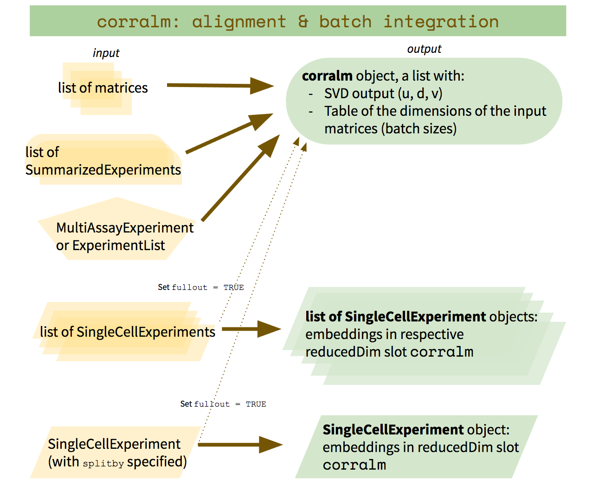

---

```{r setup, include=FALSE}
knitr::opts_chunk$set(echo = TRUE)
library(gridExtra)
```

# Introduction

Data from different experimental platforms and/or batches exhibit systematic 
variation -- i.e., batch effects. Therefore, when conducting joint analysis 
of data from different batches, a key first step is to align the datasets.

`corralm` is a multi-table adaptation of correspondence analysis designed 
for single-cell data, which applies multi-dimensional optimized scaling and 
matrix factorization to compute integrated embeddings across the datasets. 
These embeddings can then be used in downstream analyses, such as clustering, 
cell type classification, trajectory analysis, etc. 

See the vignette for `corral` for dimensionality reduction of a single matrix of single-cell data.

# Loading packages and data

We will use the `SCMixology` datasets from the `r Biocpkg('CellBench')` package [@scmix].

```{r, message = FALSE}
library(corral)
library(SingleCellExperiment)
library(ggplot2)
library(CellBench)
library(MultiAssayExperiment)

scmix_dat <- load_all_data()[1:3]

```

These datasets include a mixture of three lung cancer cell lines:

* H2228
* H1975
* HCC827

which was sequenced using three platforms:

* 10X
* CELseq2
* Dropseq

```{r}
scmix_dat
```

Each sequencing platform captures a different set of genes. 
In order to apply this method, the matrices need to be matched by features (i.e., genes). 
We'll find the intersect of the three datasets, then subset for that as we proceed.

First, we will prepare the data by:
1. adding to the colData the sequencing platform (`Method` in `colData` for each SCE), and 
2. subsetting by the intersect of the genes.

```{r}
platforms <- c('10X','CELseq2','Dropseq')
for(i in seq_along(scmix_dat)) {
  colData(scmix_dat[[i]])$Method<- rep(platforms[i], ncol(scmix_dat[[i]]))
}

scmix_mae <- as(scmix_dat,'MultiAssayExperiment')
scmix_dat <- as.list(MultiAssayExperiment::experiments(MultiAssayExperiment::intersectRows(scmix_mae)))

```



`corralm` can be applied to the following types of objects:

* **a single `r Biocpkg('SingleCellExperiment')`** requires specifying `splitby` (also see documentation of `corralm_matlist` for additional optional arguments that can be passed), which is a character string for the attribute in `colData` that is tracking the batches. In our case, this would be the "Method" attribute we just added. The output from this type of input is the same `SingleCellExperiment`, with the result added to the `reducedDim` slot under `corralm`.
* **a list of `r Biocpkg('SingleCellExperiment')`** does not require any specific arguments. The output is a list of the input `SingleCellExperiment`s, with the result added to the `reducedDim` slot under `corralm`.
* **a list of matrices** (or other matrix-like objects: matrix, Matrix, tibble, data.frame, etc.) also does not require specific arguments. The output will be a concatenated list of SVD output matrices (`u`,`d`,`v`) where `v` contains a concatenated vector of the embeddings for the cells
* **a list of `b Biocpkg('SummarizedExperiment')`s** does not require specific arguments. The output is the same as for a list of matrices.
* **`r Biocpkg('MultiAssayExperiment')` or `ExperimentList`** does not require any specific arguments. `corralm` will identify the intersect of the rows, and use these to match the matrices. The output will be the same as for a list of matrices.

For purposes of illustration, we will walk through using `corralm` with a single SCE, and with a list of matrices.

# `corralm` on a single `r Biocpkg('SingleCellExperiment')`

First, setting up the data to demonstrate this:
```{r}
colData(scmix_dat[[2]])$non_ERCC_percent <- NULL
# need to remove this column so the objects can be concatenated

scmix_sce <- SingleCellExperiment::cbind(scmix_dat[[1]],
                                         scmix_dat[[2]],
                                         scmix_dat[[3]])
```

Running `corralm`, and specifying the `splitby` argument:
(Note that the default is for the `counts` matrix to be used. 
To change this default, use the `whichmat` argument.)
```{r}
scmix_sce <- corralm(scmix_sce, splitby = 'Method')
```

Visualizing the results:
```{r}
plot_embedding_sce(sce = scmix_sce, 
                   which_embedding = 'corralm', 
                   color_attr = 'Method', 
                   color_title = 'platform', 
                   ellipse_attr = 'cell_line', 
                   plot_title = 'corralm on scmix', 
                   saveplot = FALSE)
```

# `corralm` on a list of matrices

Again, preparing the data to be in this input format:
```{r}
scmix_matlist <- sce2matlist(sce = scmix_sce, 
                             splitby = 'Method', 
                             whichmat = 'counts')

# for plotting purposes later, while we're here
platforms <- colData(scmix_sce)$Method
cell_lines <- colData(scmix_sce)$cell_line
```

Running corralm and visualizing output...
(the embeddings are in the `v` matrix because these data are matched by genes 
in the rows and have cells in the columns; if this were reversed, with cells 
in the rows and genes/features in the column, then the cell embeddings would 
instead be in the `u` matrix.)
```{r}
scmix_corralm <- corralm(scmix_matlist)
scmix_corralm
plot_embedding(embedding = scmix_corralm$v, 
               plot_title = 'corralm on scmix', 
               color_vec = platforms, 
               color_title = 'platform', 
               ellipse_vec = cell_lines, 
               saveplot = FALSE)
```

As expected, we get the same results as above. (Note that in performing SVD, 
the direction of the axes doesn't matter so they may be flipped between runs, 
as `corral` and `corralm` use `irlba` to perform fast approximation.)

# Session information

```{r}
sessionInfo()
```

# References
